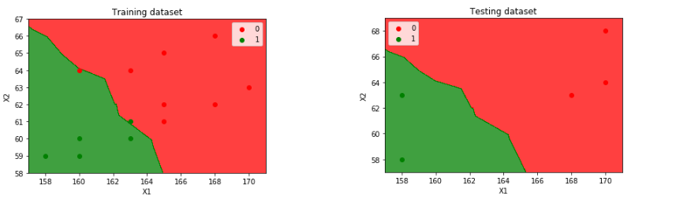
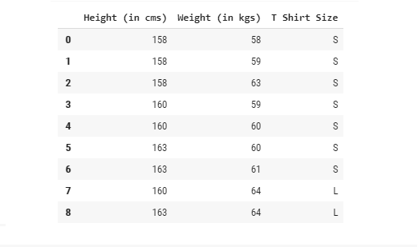
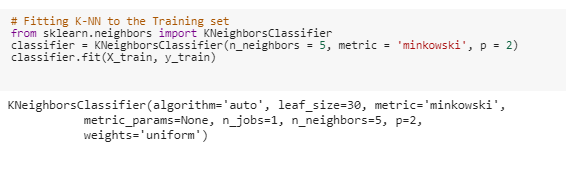
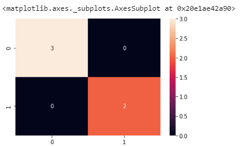

#### Machine Learning - K-NEAREST NEIGHBORS

# T-shirtSizes--Classification

## Background

Online clothing business and you would like to develop a new app (or in-store) feature in which customers would enter their own height and weight and the system would predict what T-shirt size should they wear. Features are height and weight and output is either L (Large) or S (Small).

DATA SOURCE: https://www.listendata.com/2017/12/k-nearest-neighbor-step-by-step-tutorial.html

## Goals

* Split the data in Train and Test
* Train and Test the model in the data set
* Visualize data points
* Classify the T-shirts by size

## How to run 

Open Google Colab https://colab.research.google.com/
* File
* Upload Notebook
* Run the Cells

## Proccess

Import the data set and visualize the data
#   

* Transforming the data
* Spliting in Train and Test 
* Creating the model
#  

Testing the model
#  

Visualizing
* Train results
* Test results
#  

